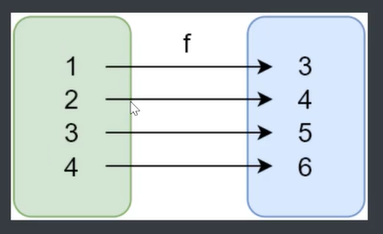
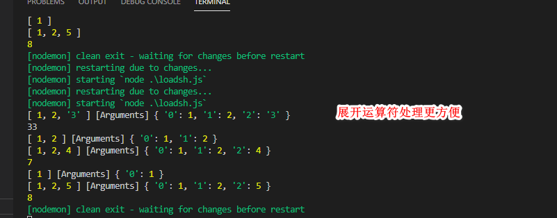
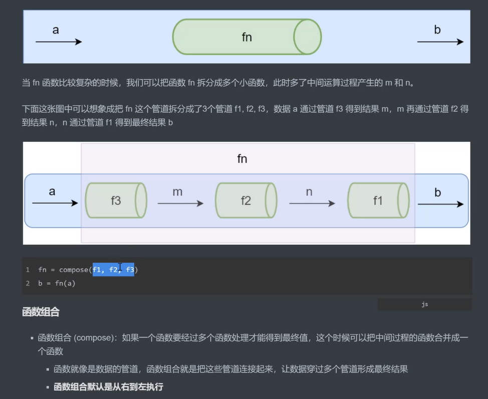
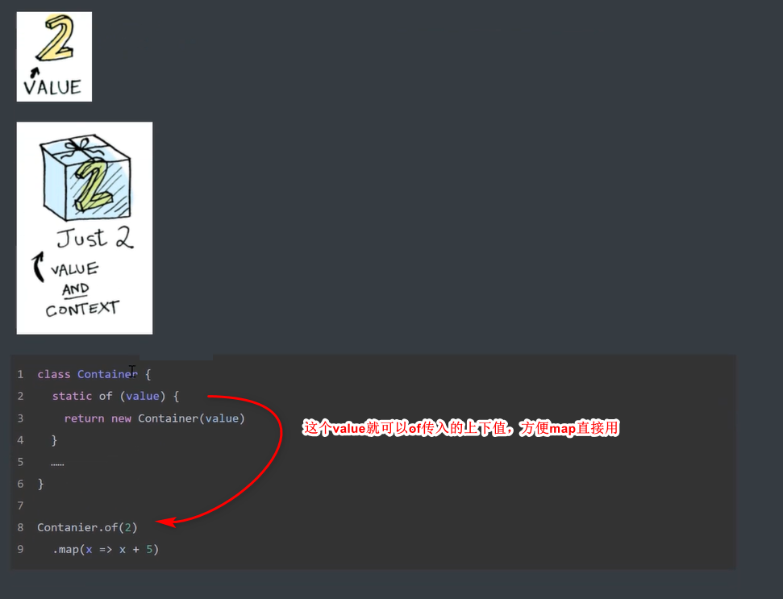

# javascript 函数式编程
### （一）概述
1.什么是函数式编程
http://www.ruanyifeng.com/blog/2017/02/fp-tutorial.html
 函数式编程（Function Programming,FP），是一种编程风格，或者说是编程范式之一，常听说的式面试对象，面向过程

 面向对象的思维方式，就是把现实世界的事务抽象成程序世界的类和对象，封装、继承、多态去演示事务、事件的关系

 函数式编程则是将现实事物和事务之间的联系抽象到程序世界

 函数式编程的函数不是指程序中的函数。而是想数学中的函数的映射关系。y=sin(x),x和y的关系
  - 相同的输入，相同的输出


``` javascript
//非函数式编程
let a = 1
let b = 2
let sum= a + b


//函数式编程
funtion add(x,y){
    return x+y
}
add(a,b)
```


2.函数式编程的前置知识
1、函数是一等公民 First-class Func
   函数可以存储变量
   函数作为参数
   函数作为返回值


   再JS中函数就是一个不同对象，可以通过new FUcntion() ，所以我们可以把函数存储到变量和数组中去，也可以作为反回值处理；


2、高阶函数
    higher-order-func
 - 函数作为参数
   
 - 函数作为返回值
    once函数，只调用一次，
    funtion once(fn) {
        let done = false;
        return function() { //这里传的参数abc
            if (!done) {
                done = true;
                // function(){} 的abc参数传递给fn
                return fn.apply(this, arguments)
            }
        }
        return function(abc) { //按以往，可能你要这个定义参数,然后多个参数，这里就定义多个参数，那下面也需要fn(abc,x,y....)多个参数
            if (!done) {
                done = true;
                // return fn.apply(this, arguments)
                fn(abc,x,y....)
            }
        }
    }
    apply() 方法调用一个具有给定this值的函数，以及作为一个数组（或类似数组对象）提供的参数。
    func.apply(thisArg, [argsArray])

    thisArg
    必选的。在 func 函数运行时使用的 this 值。请注意，this可能不是该方法看到的实际值：如果这个函数处于非严格模式下，则指定为 null 或 undefined 时会自动替换为指向全局对象，原始值会被包装。 

    argsArray
    可选的。一个数组或者类数组对象，其中的数组元素将作为单独的参数传给 func 函数。如果该参数的值为 null 或  undefined，则表示不需要传入任何参数。从ECMAScript 5 开始可以使用类数组对象。 浏览器兼容性 请参阅本文底部内容。  


    在调用一个存在的函数时，你可以为其指定一个 this 对象。 this 指当前对象，也就是正在调用这个函数的对象。 使用 apply， 你可以只写一次这个方法然后在另一个对象中继承它，而不用在新对象中重复写该方法。 


    call()方法的作用和 apply() 方法类似，区别就是call()方法接受的是参数列表，而apply()方法接受的是一个参数数组。


  - 高级函数的意义，其实就是我们不用管里面细节，只要关注我们的目标，只需要管调用。
  
  //面向过程
    let array = [1, 2, 3, 4, 5]
    for (let index = 0; index < array.length; index++) {
        console.log(arr[index])
    }

    //高阶函数
    forEach(array, function(item) {
        console.log(item)  
    })

 常用的高阶函数
 数组函数偏多因为都有一个fn作为参数
3、闭包
   函数和周围状态的引用捆绑再一起形成闭包
   可以再另一个作用域中调用一个函数的内部函数并访问改函数的作用域的成员。。。

```javascript
function test() {
let msg = 'test'
return function(){
  console.log(msg)
}
}

test()()
```

 本质，函数再执行的时候会放到执行栈上，当函数执行完毕就会冲栈上移除，但是堆上的作用域成员被外部应用不能释放

Closure

### 纯函数
  相同的输入永远会得到相同的输出而没有任何可以观察的副作用，就像数学中的函数y=f(x)
   

  数组中的slice 【纯】和 splice【不纯】 ---因为它改变了原数组

  函数式编程中不会保留计算中间的结果，所以变量式不可变的
   
### lodash 一个纯函数的库，提供对数组、数字、对象、字符串、函数等操作的func


### 纯函数的好处
 - 可以缓存
   可以把纯函数结果缓存下来

``` javascript
  //因为同样的输入会有同样的输出，那我们就可以将输入后的输出结果缓存，然后下次就可以直接拿来用，这样就性能优化了
function memoize(fn) {
    let cache = {} //通过fn的参数去配置结果，这样就下次传的参数一样就可以直接拿来用了
    return function() {
        //通过arguments拿参数咯
        let key = JSON.stringify(arguments)
        cache[key] = caches[key] || fn.apply(fn, arguments)
    }
}
```

 - 可测试 ，让测试更方便
 - 并行处理
   多线程同时操作一个数据，容易出现问题。不能保证结果是什么
   而纯函数式不需要访问共享的内存数据，所以并行下就没有任何影响（web worker就是ES6后的一种并行处理方式）


   # 那没有副总用嘛，有
   因为纯函数式指一样的输入，一样的输出，但是如果函数里面有依赖外部的变量那就会变得不纯，就无法保证输出，
     ```
     let min = 18  // 硬编码

    function check(age) {
        return age >= min //>>只有把min 变量放内部
    }
     ```
     副作用来源一般：
     配置文件、数据库、用户输入、 

### 柯里化
使用柯里化处理上一个案例中的硬编码问题

``` javascript
function check(age) {
    let min = 18 // 18 写死  ---硬编码
    return age >= min
}
```
那有可能后期设置不是18，是20，那我们就得再定义一个20
``` javascript
function check(age) {
    let min = 20 // 20 写死  ---硬编码
    return age >= min
}
```
那这样的话肯定考虑参数化嘛！
``` javascript
function check(age,limit) {
    return age >= limit
}
```
但是这样的话，check(20,18);check(20,18)....就会考虑将limit处理一下，就像闭包一样。
``` javascript
function check(limit) {
  const min=limit// 简化一下啊
  return function(age){
    return age >= min //age >= limit
  }
}
let check20=check(20)
check20(18)//这样基准值就固定了，这就是柯里化。函数的多个参数传递，选择基准的参数，返回新的函数，新的函数接收剩余的参数，返回结果
```
函数的多个参数传递，返回新的函数，新的函数接收剩余的参数，返回结果

当一个函数有多个参数的时候，我们选择先传递一部分参数（这部分参数以后就会永远不变了）
然后返回一个新函数接受剩余参数，并返回结果


```
let checkage = min => (age => age >= min)
```
箭头函数只有一个代码，相当前面+return 关键字


# lodash 通用的柯里化的方法

_.curry(func)
创建一个函数，该函数接受一个或者多个func的参数，如果func 需要的参数都被提供则func并返回执行的结果。否则返回这个函数，然后继续等待传入剩余参数，
``` javascript
function getsum(a, b, c) {
    return a + b + c
}
const currd = _.curry(getsum)

log(currd(1, 2, 3))
log(currd(1, 2)(3))
log(currd(1)(2, 3))
```

# 柯里化的实例
``` javascript
const match = _.curry(function(reg, str) {
    return str.match(reg)
})

const findspace = match(/\s+/g) //...得到寻找空格的柯里化函数
const findnumber = match(/\d+/g) //...得到寻找数字的柯里化函数

log(findspace('heodas dsad'))
log(findnumber('dsad123'))


// 柯里化一个过滤函数
const filter = _.curry(function(fn, arry) {
    return arry.filter(fn)
})
// const filter = _.curry((fn, arry) => arry.filter(fn))  //如果只有一行，这样可以直接省略return
// const filter = _.curry((fn, arry) => { return arry.filter(fn) })  //这样就要加上return
log(filter(findspace, ['abc', 'ddd das']))
```
函数式编程的最大好处就是能够重用我们的函数

### 模拟一个柯里化函数

```javascript
function getsum(a, b, c) {
    return a + b + c
}
const currd = curry(getsum)

log(currd(1, 2, 3))
log(currd(1, 2)(4))
log(currd(1)(2, 5))

const curry = function(fnc) {
    return function curried(...args) { //curry 返回一个函数，这个是肯定的，所以return function。
        // args展开运算符，你也可以用arguments
        //args 是实际的参数，fnc.length 则是形参数(函数.length就是形参个数)。
        if (args.length < fnc.length) { // 然后根据柯里化的概念，如果参数全传递，那就直接返回结果，不然就返回剩余参数的函数
            // 剩余的参数怎么控制？
            return function(...args2) {
                //这里就是第二次甚至第三次，第四次执行，那这个func在执行的时候也是又argument的
                //所以处理方式就是将这次的参数argument和第一次args 合并看是否是形参的个数，如果是那就返回结果，所以就相当于再执行一下外部的func,
                //那就将外部的函数定义名字，再执行一下
                return curried(...args.concat(args2))
            }
        }
        return fnc(...args) // 或者func.apply(func,args)
    }
}
```
   

# 小结 
柯里化
 - 传递少参数的时候，得到一个缓存参数的新函数
 - 对之前的函数参数缓存 闭包
 - 让函数更灵活，颗粒度小
 - 把多元函数变成一元。组合函数更强大
 
 

 # 函数组合
 compose

 纯函数和柯里化的开发过程中经常处理函数组合，我们普遍是f(g(k(xx)))...这种洋葱式的组合开发，
 实际上我们应该将

 函数就是数据的管道，函数组合就是把这些管道链接起来，让数据闯过多个管道后最终形参结果 默认右到左
   
 一个大的函数，你可能不好排错，只有每个小管道，这样哪里漏水就一清二楚了

 # loadsh 的组合函数 flow() flowRight()
flow 从左到右的运行顺序
flowRight 从右到左 的运行顺序
 # 结合律
就是指函数搭配后的结果应该是一样】
```
let test=compose(f,g,n)
compose(compose(f,g),n)==compose(f,compose(g,n))
```
 # 调试组合函数
其实就是在组合的单个函数去log 一下，或者别的什么操作，知道是哪个函数模块

 # lodash的FP模块函数式编程

 # lodash map 和lodash FP的map 方法
lodash map---数据优先，函数之后，另外map([],fn)中的fn 会接受3个参数，item, index|key ,array
lodash FP模块 map(只接受一个参数)---函数优先 //这里个map 中的fn 也只接收一个参数
 # point free(编程风格)

 point free: 我们可以把数据处理的过程定义成与数据无关的合成运算。不需要用到代表数据的那个参数，只要简单的把运算步骤合成在一起，
 在使用这个模式之前我们需要定义有些基础的辅助运算函数 
 
 - 不需要指名处理的数据
 - 只需要合成运算过程
 - 需要定义些基础的辅助运算函数
 - lodash 已经提供了这些

```javascript
const fp = require('lodash/fp');
const { log } = console

const f = fp.flowRight(fp.replace(/\s+/g, '_'), fp.toLower)

log(f('Hello       world'))
```
其实就是将处理过程，分离成一个个小函数，然后组合一下‘


# point free 案例

``` javascript
// 提前字符串中的首字母大写并用字符 . 拼接合并
// const get = fp.flowRight(fp.join('.'), fp.map(fp.first), fp.map(fp.toUpper), fp.split(' '))
const get = fp.flowRight(fp.join('.'), fp.map(fp.flowRight(fp.first, fp.toUpper)), fp.split(' '))

log(get('world is peace'))// W.I.P
```

# Functor(函子)

为什么要学习函子
在函数式编程中如何把副作用控制在可控的范围内，异步处理、异步操作

- 什么是函子

都是建立在数学的基础上  

- 容器：包含值和值变形的关系（其实就像数学中的f(x)）
- 函子：一个特殊的容器，对外提供一个map方法，map返回一个处理了容器内的值的新的函子，


``` javascript
class Container {
    constructor(value) {
        this._value = value //要有一个接受值
    }

    map(fn) { //要有一个map方法,要接收一个处理函数
        return new Container(fn(this._value)) //要返回一个处理了值的新函子
    }
}

let r = new Container(5).map(x => x + 1).map(x => x * 2)
log(r) //Container { _value: 12 }

//改造不想要new 关键字
class Container {
    static of(value) {
        return new Container(value)
    }
    constructor(value) {
        this._value = value //要有一个接受值
    }

    map(fn) { //要有一个map方法
        return Container.of(fn(this._value)) //要返回一个处理了值的新函子
    }
}
let r = Container.of(5).map(x => x + 1).map(x => x * 2)
log(r) //Container { _value: 12 }

```
其实就是一个处理值的盒子，值一直都在盒子里面，要处理就在map的fn中处理


# 函子 总结

- 函数式编程的运算不直接处理操作值，而是定义一个函子区处理它
- 函子就是一个实现了map 契约的对象
- 我们可以想象成盒子，盒子里面封装了一个值
- 要想处理这个值，就通过map的fn（纯函数）
- 最后map会返回一个新的盒子（函子）


# Maybe 函子

上面的函子其他如果传了null 然后调用map 就会报错
那我们就需要处理这种副作用

那Maybe函子就会处理

- 编程过程中我们经常会可能遇到很多错误，需要对这些相应处理
- Maybe 就是对外部的空值做处理（控制在允许的范围内）


```javascript
... 

map(fn) { //要有一个map方法
    return this.isNull() ? Container.of(null) : Container.of(fn(this._value)) //要返回一个处理了值的新函子
}

isNull() {
    return this._value === undefined || this._value === null
}
```
其实就是追加一个方法判断嘛！....简单说，它的map方法里面设置了空值检查。

```javascript
log(Container.of(5)
    .map(x => x + 1)
    .map(x => x * 2)
    .map(x => null)
    .map(x => x.split(' ')))
```
然后我们故意返回null. 虽然不会报错，但是不确定哪一次出现了问题（其实就像开发中调用了多次函数，没拿到结果就会调试哪里处理不对一样的道理）

# Either 函子

- 两种中的一个，if...else...
- 异常会让函子变得不纯。Either就可以做异常处理
  
  
```javascript
class left {
    static of(value) {
        return new left(value)
    }
    constructor(value) {
        this._value = value
    }

    map(fn) {
        return this
    }
}

class right {
    static of(value) {
        return new right(value)
    }
    constructor(value) {
        this._value = value
    }

    map(fn) {
        return right.of(fn(this._value))
    }
}

```
综上代码，很明显就是如果没错就用right ..反之 那就用left
- Either 函子的常见用途是提供默认值
  可以查看http://www.ruanyifeng.com/blog/2017/02/fp-tutorial.html的介绍
- Either 函子的另一个用途是代替try...catch，使用左值表示错误。
```javascript
function parse(value) {
try {
    return right.of(JSON.parse(value))
} catch (e) {
    return left.of({ error: e.message })
}
}

log(parse('xcsd'));//left {_value: { error: 'Unexpected token x in JSON at position 0' } }
log(parse('{ "name": "zs" }'))//right { _value: { name: 'zs' } }
```

# IO函子

- IO函子的_value 是一个函数，把函数作为值来处理
- IO函子把不纯的动作存在_value中，延迟执行这个不纯的操作
- 把不纯的操作交给调用者处理

``` javascript
class IO {
    static of(value) { //of 还是返回函子，但是一个包装了一个外部数据的函子
        return new IO(function() { //刚好按构造函数定义传了一个fn
            return value
        })
    }
    constructor(fn) { //IO 函子就不是传value ,而是一个fn
        this.value = fn
    }
    map(fn) {
        // this.value == function (){ return value }
        return new IO(fp.flowRight(fn, this.value)) //IO 的map 是返回一个新的函子，of 就不满足了所以new 。并将两个函数组合
    }
}
log(IO.of(process).map(p => p.execPath).value)//==>funtion(process){ return process.execPath }
```

# folktale Task异步执行

另一个函数式编程库
- 和lodash、ramda不同的是，他没有提供很多功能的函数
- 只是提供了函数式处理的操作

# folktale中的Task 函子

``` javascript
const fs = require('fs')
const { task } = require('folktale/concurrency/task')

function readfile(filename) {
    return task(resolver => { //固定参数
        fs.readFile(filename, 'utf-8', (err, data) => { // 编码格式和回调
            if (err) resolver.reject(err)

            resolver.resolve(data)
        })
    })
}

readfile('package.json')
    .map(split('\n')) //那其实这里就不用管内部实现，我们只要整体的运行机制。map 返回新的函子，并传递处理后的数据
    .map(find(x => x.includes('version')))
    .run() //返回的task 函子要run 才会运行
    .listen({
        onRejected: err => {
            console.log(err)
        },
        onResolved: value => {
            console.log(value)
        }
    })
```

# pointed 函子
 - 实现了静态of 方法的函子
 - of 在之前的代码中是为了不用new 创建对象，其实更深沉的含义是为了把值放容器中，方便map调用


另外Reflec 提供了很多方法可以获取对象的属性等操作

``` javascript
const fs = require('fs')
const { task } = require('folktale/concurrency/task')

function readfile(filename) {
    return task(resolver => { //固定参数
        fs.readFile(filename, 'utf-8', (err, data) => { // 编码格式和回调
            if (err) resolver.reject(err)

            resolver.resolve(data)
        })
    })
}

readfile('package.json')
    .run() //返回的task 函子要run 才会运行
    .listen({
        onRejected: err => {
            console.log(err)
        },
        onResolved: value => {
            console.log(value)
        }
    })
```
   

# Monad (单子)

针对函子嵌套处理，读取内容的value，要连续._value  
Monad 函子的作用是，总是返回一个单层的函子 具备join 和 of 的两个方法并遵循一些定律

它有一个flatMap方法，与map方法作用相同，唯一的区别是如果生成了一个嵌套函子，它会取出后者内部的值，保证返回的永远是一个单层的容器，不会出现嵌套的情况。
``` javascript
class IO {
    static of(value) { //of 还是返回函子，但是一个包装了一个外部数据的函子
        return new IO(function() { //刚好按构造函数定义传了一个fn
            return value
        })
    }
    constructor(fn) { //IO 函子就不是传value ,而是一个fn
        this._value = fn
    }
    map(fn) {
        return new IO(fp.flowRight(fn, this.value)) //IO 的map 是返回一个新的函子，不是of 直接调用。并将两个函数组合
    }
    join() {
        return this._value()
    }
    flatMap() {
        return this.map(fn).join() //this.map(fn) 返回一个嵌套函子执行一下join扁平化
    }
}
```
# 函数是编程总结

### javascript 性能优化

# 内存管理的介绍
- 内存：由可读写单元组成，表示一片可以操作的空间
- 管理：人为的去操作空间的申请、读写、释放
  
``` javascript
//申请
let obj={}
//使用
obj.name='xxx'
//释放
obj=null
```

# 垃圾回收

- JavaScript中内存管理是自动的
- 对象不再被引用时是垃圾
- 对象不能从根本上访问到时也是垃圾
- 可以访问到的对象就是可达对象（引用、作用域链）
- 可达的标准就是从根出发是否能够被找到
- JavaScript的根可以理解为全局变量


# GC算法
- GC垃圾回收机制的简写
- GC可以找到内存中的垃圾、释放&收回
- 算法就是工作时查找和回收所遵循的规则
  
# 常见的GC算法名称
- 引用计数
- 标记清楚
- 标记整理
- 分代回收

# 引用计数
其实就是看变量的引用数是不是变为0.....
优点：
- 发现垃圾及时回收
- 最大限度减少程序暂停，可以理解为，运行趋于满内存的时候，回收引用计数0的

缺点：
- 无法回收循环引用的对象
- 时间开销大。毕竟要监控引用计数值

# 标记清除算法
- 能够处理循环引用的对象
- 核心思想：分标记和清除两个阶段完成
- 遍历所有对象，找标记活动对象
- 回收相应的空间

# 标记清除算法（优缺点）
空间碎片化：回收后的空间放在空闲链表，但是大小是确定的并且是不连续的。所以如果后期新申请的空间不匹配大小的化，就还在空闲链表。

# 标记整理算法
多了一个整理空间的过程，减少空间碎片化

# 总结

### V8 引擎

# 介绍
- v8 是一款主流的JS执行引擎
- 采用即时编译
- 内存有上限

# v8 回收策略

新生代
- 分代回收
  新生代和老生代，新生代分为from & to 两个等大小的空间
  from 活动对象整理后复制到to,然后清理之后，从to里面拿回来
  （晋升）：TO空间超过25%。
- 空间复制

老生代
- 标记清除
- 标记整理
- 标记增量


# preformance

监控内存工具

# 内存问题的体现

- 页面延迟加载经常性暂停
- 页面持续性糟糕性能
- 性能随随时间越来越差 

# 常见监控内存方式

- 内存泄漏：内存持续高涨
- 内存膨胀：多数是设备上存在性能差异
- 频繁的垃圾回收：通过内存变化图进行分析

方法：
任务管理器检查
Timeline
堆快照查找分离DOM

# 任务管理器查看内存变化 （shift + esc）


Map 结构，但是它的key 是可以用对象作为key[其实是任意类型的数据都可以]；而普通的obj 是会被自动tostring(),转成字符串[object object]
同样有 has(),delete(),clear()...etc

new Map([
    ['test', 111],
    ['aaaa', 222]
]).foreach()--->也可以用来遍历map对象的key value

17.symbol 类型

   体会：例如我们在开发中很容易的变量冲突问题，const abc={}, 我定义了abc['test']='xx' ,然后另一个不知道也定义了abc['test']='2222';
   那这样就把我的定义覆盖了，通常我们会定义规范，abc['a_test'],abc['b_test'],但是只要有人不守规范，那就died..
   
   所以有了const s = Symbol();
   symbol 是独一无二的类型；
   
``` javascript
Symbol()===Symbol() //false
Symbol('des') //string 参数作为该symbol数据的描述内容，用于区分多个symbol,但是实际上描述可以重复，
Symbol('private')===Symbol('private') //false, 但是实际不是同一个
Symbol.for('test') === Symbol.for('test')  // true, 这样就是同一个了，其实也是内部处理也是利用维护一个全局变量做的

```

``` javascript
const s = Symbol();
const person = {
  [s]: 'test',// symbol 作为key 必须[]包裹是吧
  hello() {
      log(this[s]);//取值也是一样。
  }
};
person.hello();
// 另外，symbol() 作为key的,Object.kes(), JSON.stringify(),都拿不到的。。。只有getOwenPropertySymbols()能拿到
```
    
18.for of 循环，一个能够遍历所有数据结构的

  可以break终止遍历。。太好了。

``` javascript
const set = new Set(['abc', 'def']);
for (const item of set) {
    log(item);//abc def
}


const mp = new Map();
mp.set('abc', 123)
mp.set('def', 345)
for (const item of mp) {
    log(item);//[ 'abc', 123 ] [ 'def', 345 ]
}
for (const [key,value] of mp) {
    log(key,value);//abc 123 ；def 345
}

// 但是Object 不能直接用。。必须实现Iterator
```

19.实现Iterator
  
  可以手动去调用那些能for in 的Symbol.iterrator看看
   
   
   

 同样的set map 都是利用这个next.  所以说for of 可以遍历所有数据，都是要实现这个iterator的next();

``` javascript
const obj = {
    [Symbol.iterator]: function() { //Iterable---[Symbol.iterator] func
        return { //Iterator--next func
            next() {
                return { //IteratorRst ---value done
                    value: 'text',
                    done: true
                }
            }
        }
    }
}
  ```

  其核心就是对外开发一个统一遍历内部数据的外部接口。这样其他模块只要调用就好了。

20.Generator 生成器，其实就是按上面的Iterator规范处理,配合yield

``` javascript
  function* test() {
    log(1)
    yield 1;//类似return 会中断后面的操作。但是实际上是返回一个 next() 再next() 一下就会往下走。
    log(2);
    yield 2;
    log(3);
  }

  log(test())// 返回一个 Object [Generator] {} ，对象包含迭代器的next 方法
  //只有调用对象的next方法才能真正执行函数体，然后遇到yield 就会终止，等待下一次next()
  const ger = test();
  log(ger.next());//1  { value: 1, done: false } 
  log(ger.next())//1  { value: 1, done: false }； 2  { value: 2, done: false }
  log(ger.next())//1  { value: 1, done: false }； 2  { value: 2, done: false } 3 { value: undefined, done: true }---因为没有了yield, 它就认为是到底了，然后done就为true.
```
  
  配合之前的迭代器。那就可以优化了
``` javascript
const obj = {
  [Symbol.iterator]: function * () { //Iterable---[Symbol.iterator] func
      // return { //Iterator--next func
      //     next() {
      //         return { //IteratorRst ---value done
      //             value: 'text',
      //             done: true
      //         }
      //     }
      // }
      yield 'xxx'
  }
}
```

21.ESModule(待补充)

22.ES2016,ES2017 新加方法
 - Array.includes() 
 - Object.values() ，对比keys()
 - Object.entries()  //[[key,value],[key,value]...]