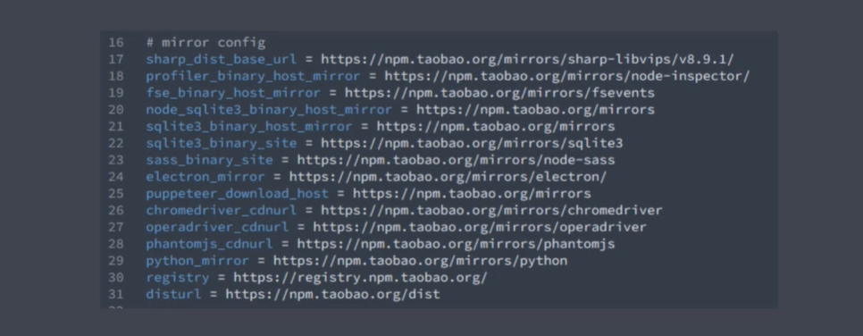
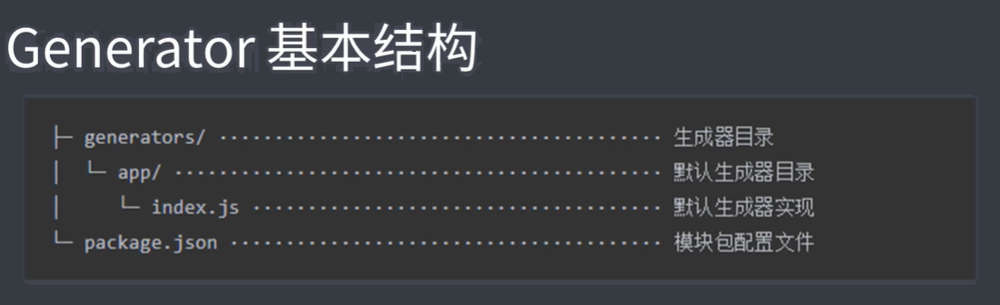
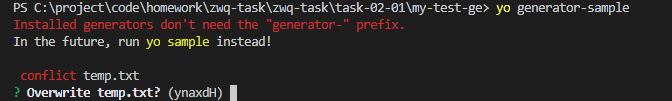
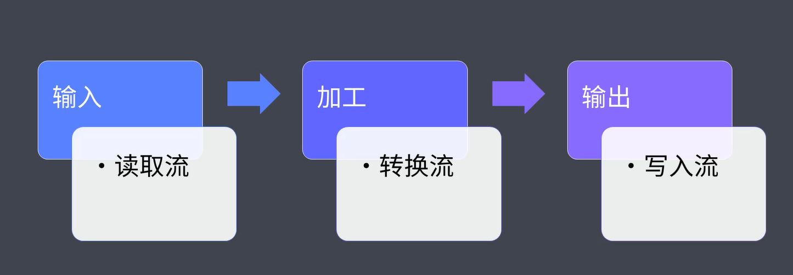

### 前端工程化

# 脚手架的本质作用
 创建项目结构、提供项目规范和约定  

# Yeomen
 通用性脚手架

 - yarn global add yo
 - yarn global add generator-node

 
 - 在全局范围安装yo
  ```
  $ npm install yo --global # or yarn global add yo
  ```  

 - 安装对应的generator
  ```
  $ npm install generator-node --global # or yarn global add generator-node
  ```

  - 通过yo运行generator
  ```
  $ cd path/to/project-dir
  $ mkdir my-module
  $ yo node
  ```

# Sub Generator
 
 yo node:cli 安装子类的生成器

 # 常规使用步骤

 通用性的脚手架工具
 1、明确需求  
 2、找到合适的generator  
 3、全局范围安装generator  
 4、通过yo运行generator
 5、通过命令行交互填项选项
 6、生成你需要的项目结构

 eg：  
  yarn global add generator-webapp  

  yo webapp

  针对一些包下载加速
   

# 自定义Generator
自定义一个带有基础代码的vue脚手架

generator 基本结构
   

# 必须是generator-<name>形式

```javascript
//此文件作为ge 入口
//需要导出一个 继承于Yeoman ge.的类型
//yeoman ge 在工作时会自动调用我们在此类型中定义的一些生命周期方法
//我们呢可以在这些方法中通过调用父类提供的一些工具方法实现一些功能，例如：文件写入


const Generator = require('yeoman-generator')

module.exports = class extends Generator {
    writing() {
        //yeoman 自动在生成文件阶段调用此方法
        //尝试在项目目录写入一个简单文件
        this.fs.write( //两个参数，路径和内容
            this.destinationPath('temp.txt'),
            Math.random().toString()
        )
    }
}
```
yarn link

https://www.javascriptcn.com/read-5ec5ea0c43cab96a7c109153.html

Q:  
在生成器过程，我们生成的项目名是generator-sample，但是执行的时候是yo sample 因为不需要前缀
   


# 模板创建文件

```javascript
...
// 2、使用模板方式
const tmpl = this.templatePath('foo.txt'); // /templates/ 这个方法就是在这个路径下找
const output = this.destinationPath('foo.txt');
const content = {
    title: '测试一下',
    success: true
}
this.fs.copyTpl(tmpl, output, content)
...
```

# 用户询问，接受用户输入的选择

```javascript
module.exports = class extends Generator {
    prompting() {
        //Yeoman 询问用户环节自动调用该方法
        //调用父类的prompt() 方法对用户命令询问
        // 数组参数
        return this.prompt([{
            type: 'input',
            name: 'name',
            message: 'Your project name',
            default: this.appname //项目生成目录名称
        }]).then(answer => {
            // answer == 用户自己输入的内容,对象形式{}--key 是name的值
            this.answers = answer //挂在到 this ,这样write的时候就能用了
        })
    }
    writing() {
        // 2、使用模板方式
        const tmpl = this.templatePath('bar.html'); // /templates/ 这个方法就是在这个路径下找
        const output = this.destinationPath('bar.html');
        const content = this.answers
        this.fs.copyTpl(tmpl, output, content)
    }
}
```

# 改写一个基于vue的脚手架

1、和基础的生成器一样  
2、但是templates换成vue 的基础代码，然后vue中相应的需要改写的用EJS语法定义  
3、这时候我们需要循环创建文件了，那就定义文件path数组，指向templates的vue文件  
4、执行相应命令 

# 发布npm仓库

# plop
 自动帮我们创建一些文件，类似ng 创建组件类似，直接生成scc. js. moudle.ts 等相关文件

# plop基本使用
1、安装plop 依赖
2、根目录新建plopfile.js文件配置
```javascript
module.exports = plop => {
    plop.setGenerator('component', { //自己定义名称，后面执行命令用
        description: 'creat a component',
        prompts: [{
            type: 'input',
            name: 'yourName',
            message: 'component name',
            default: 'Mycomponent'
        }],
        actions: [ //真正执行的配置
            {
                type: 'add', // 代表新增文件
                path: 'src/components/{{yourName}}/{{yourName}}.js', //js 文件
                templateFile: 'plop-templates/components.hbs' //后缀名是一种模板类型
            },
            {
                type: 'add', // 代表新增文件
                path: 'src/components/{{yourName}}/{{yourName}}.css', //css 文件
                templateFile: 'plop-templates/components.css.hbs' //后缀名是一种模板类型
            }
            ....
        ]
    });
};
```
3、新建‘plop-templates’ 根目录的模板文件夹

# 脚手架工作原理


### 自动化构建

一切重复的工作都可以自动化

构建==转化

原代码==》转化==》生产

自动化构建

# 自动化构建的好处

# npm scripts
就是在package.json 配置script 命令
```
script {
    'build':'xxx'
    'preserve':''//执行serve 之前会自动执行
    'serve':''
}
```

--watch  sass 命令的监听

- brower-sync.

# 常用的自动化构建工具
- grunt 构建速度慢，每一步都是磁盘读写
- glup 基于内存实现。相对于磁盘读写快多了，同时执行多个任务
- fls 百度，前端团队。
  
  webpack?? 模块打包工具，和自动化构建工具有点区别

# 小结-
\


### grunt 

```javascript
module.exports = grunt => {
grunt.registerTask('test1', '任务描述', () => { //可以在-help 看到available中提示的内容。
    console.log('test1')
})

grunt.registerTask('test2', '任务描述', () => { //可以在-help 看到available中提示的内容。
    console.log('test2')
})

grunt.registerTask('default', () => { //yarn grunt -->默认执行gruntfile.js 中配置的default 任务，没有的话就会警告！
    console.log('this is default')
})

grunt.registerTask('default', ['test1', 'test2']) //

}
```
yarn grunt -->默认执行gruntfile.js 中配置的default 任务，没有的话就会警告！

默认支持同步操作，异步操作要通过this.async()

```javascript
grunt.registerTask('async', function() {
const done = this.async()
setTimeout(() => {
    console.log(111)
}, 1000)
})
```

# Grunt 标记任务失败

函数体return false 来表明，而且后面的任务不再会执行
```
const done = this.async()
...
done(false)
...
```

# Grunt 配置方法

```javascript
grunt.initConfig({
foo: 'bar'
})
grunt.registerTask('test', '任务描述', () => {
console.log('test', grunt.config('foo')) //还支持.语法去拿foo里面的对象。如果是对象的话
});
```

# grunt 多目标任务

```javascript
// 多任务模式，通过配置去形成多个子任务
grunt.initConfig({
    build: {
        options:{
            foo:'xxx'
        },
        js: 1,
        css: 2
    }
})
grunt.registerMultiTask('build', '任务描述', function() { 
    console.log(this.option())// 就是上面配置的options 
    console.log('多任务开始', this.target, this.data) //注意箭头函数的this问题
});
/*
terminal输出：
Running "build:js" (build) task
多任务开始

Running "build:css" (build) task
多任务开始
*/

```
# grunt 插件使用

eg:清除插件，grunt-contrib-clean

配置方法都是插件网站上会有，一般都是插件定义的key，比如下面的clean。然后里面的一般是options为配置参数，剩下必须要有一个启动的mian.自己随便定义

```javascript
grunt.initConfig({
    clean: {
        temp: "temp/**" //两个*匹配所有
    }
})
grunt.loadNpmTasks('grunt-contrib-clean');
```

# grunt 常用插件&总结

```javascript
const sass = require('sass')
const loadgruntTasks = require('load-grunt-tasks')
module.exports = grunt => {
    grunt.initConfig({
        sass: {
            options: {
                sourceMap: true,
                implementation: sass
            },
            main: {
                files: {
                    'dist/css/main.css': 'src/scss/a.scss',
                }
            }
        },
        babel: {
            options: {
                sourceMap: true,
                presets: ['@babel/preset-env']
            },
            main: {
                files: {
                    ...
                }
            }
        },
        watch:{//grunt-contrib-watch --
            js:{
                files:[],
                tasks:['babel'],//上面配置的babel 任务。
            }
        }
    })
    //grunt.loadNpmTasks('grunt-sass'); //随着使用的task多，那要写很多loadNpmTasks...安装load-grunt-tasks去做
    loadgruntTasks(grunt) //自动加载所有的你配置的插件任务。
}
```


### Gulp 

# 组合任务

```javascript
const { series, parallel } = require('gulp')

const task1 = done => {
    setTimeout(() => {
        console.log('task1ing')
        done()
    })
}

const task2 = done => {
    setTimeout(() => {
        console.log('task2ing')
        done()
    })
}

exports.foo = series(task1, task2) //串行，one by one
exports.bar = parallel(task1, task2) //并行，一起执行
```
# 异步任务的三种方式

```javascript
exports.callback = done => {
    console.log('callback done')
    done()
}
exports.callback_error = done => {
    console.log('callback_error done')
    done(new Error('task failed!')) //这样就会默认失败，后续的任务就会中断
}

exports.promise = () => {
    console.log('promise done')
    return Promise.resolve() // 这里你传值也会被gulp忽略
}
exports.promise_reject = () => {
    console.log('promise_reject done')
    return Promise.reject(new Error('task_failed'))
}

exports.async= async()=>{
    await ... // 受限于node环境>8.0
}

exports.stream = () => {//大部分使用这种。毕竟大部分就是处理文件
    const readstream = fs.createReadStream('package.json')
    const Wstream = fs.createWriteStream('temp.txt')
    readstream.pipe(Wstream) //
    return readstream //其实也就是做了 readstream.on('end',()=>{ done() })
}
```
# gulp 构建过程核心原理


```javascript
exports.default = () => {//大部分使用这种。毕竟大部分就是处理文件
    const readstream = fs.createReadStream('package.json')//读取流
    
    const Wstream = fs.createWriteStream('temp.txt')//写入流
    
    readstream.pipe(Wstream) //读取的文件写入文件流

    return readstream //其实也就是做了 readstream.on('end',()=>{ done() })
}
```
 

# glup 文件操作API + 插件使用

```javascript
const { src, dest } = require('gulp')

exports.default = () => {
    return src('src/*.css')
    .pipe(cleanCss()) //转化流 clean-css 插件
    .pipe(dest('dist')) //
}
```
# 自动化构建案例

# 样式编译


```javascript
const { src, dest} = require('gulp')

const sass = require('gulp-sass')
const style = () => {
    return src('src/assets/styles/*.scss', { base: 'src' }) //base 设置基础文件路径，这样打包的文件就能按源文件src后面的路径一致
        .pipe(sass({ outputStyle: 'expanded' })) //glup-sass 插件,expanded--设置打包后的格式样式，
        .pipe(dest('dist'))
}

module.exports = {
    style
}
```

# 脚本编译

```javascript
const script = () => {
    return src('src/assets/script/*.js', { base: 'src' }) //base 设置基础文件路径，这样打包的文件就能按源文件src后面的路径一致
        .pipe(babel())
        .pipe(dest('dist'))
}
```
其中babel要理解只是转化平台，提供环境，具体是babel的一些插件，而preset-env就是将Es6+的转化插件。所以上面只是设置babel()
输出文件就没有什么区别

```
.pipe(babel({ presets: ['@babel/preset-env'] })) //这样才能转化
```

# html 文件编译

swig 模板引擎

```javascript
// 模板中的数据啦
const data = {
  menus: [
    {
      name: 'Home',
      icon: 'aperture',
      link: 'index.html'
    },
    {
      name: 'Features',
      link: 'features.html'
    },
    {
      name: 'About',
      link: 'about.html'
    },
    {
      name: 'Contact',
      link: '#',
      children: [
        {
          name: 'Twitter',
          link: 'https://twitter.com/w_zce'
        },
        {
          name: 'About',
          link: 'https://weibo.com/zceme'
        },
        {
          name: 'divider'
        },
        {
          name: 'About',
          link: 'https://github.com/zce'
        }
      ]
    }
  ],
  pkg: require('./package.json'),
  date: new Date()
}
...
const page = () => {
    return src('src/*.html', { base: 'src' }) //base 设置基础文件路径，这样打包的文件就能按源文件src后面的路径一致
        .pipe(swig({ data }))
        .pipe(dest('dist'))
}
```


- 组合一下上面的任务

```javascript
const compile = parallel(style, script, page) //没有互相依赖就是parallel 并行

module.exports = {
    compile
}
```

# 图片&字体文件

gulp-imagemin  插件

```javascript
const image = () => {
  return src('src/assets/images/**', { base: 'src' })
    .pipe(plugins.imagemin())
    .pipe(dest('dist'))
}

const font = () => {
  return src('src/assets/fonts/**', { base: 'src' })
    .pipe(plugins.imagemin())
    .pipe(dest('dist'))
}

```

然后再整合到上面的compile中去

# 公用文件&文件清除

```javascript
const extra = () => {
  return src('public/**', { base: 'public' })
    .pipe(dest('dist'))
}
```

- yarn del --dev 清除插件


```javascript
...
const del = require('del')
const clean = () => {
    return del(['dist'])
}
...
const compile = parallel(style, script, page)

const build = series(clean, parallel(compile, extra)) //整合到一起
module.exports = {
    compile,
    build
}
```
执行就能看到clean先而且完成之后再并行其他任务
```
[21:20:35] Starting 'build'...
[21:20:35] Starting 'clean'...
[21:20:35] Finished 'clean' after 19 ms
[21:20:35] Starting 'extra'...
[21:20:35] Starting 'style'...
[21:20:35] Starting 'script'...
[21:20:35] Starting 'page'...
Browserslist: caniuse-lite is outdated. Please run next command `yarn upgrade`
[21:20:35] Finished 'extra' after 395 ms
[21:20:35] Finished 'script' after 399 ms
[21:20:35] Finished 'style' after 401 ms
[21:20:35] Finished 'page' after 408 ms
[21:20:35] Finished 'build' after 433 ms
Done in 1.35s.
```


# 自动化加载插件，避免手动require多次

- gulp-load-plugins
自动加载package.json中的插件。那加载后的使用方式就是直接用 loadPlugins返回的对象，点语法去获取相应的插件  
eg:gulp-sass--->plugins.sass，如果是后面还有-，那就驼峰获取  

当然前提是gulp的插件。  

那像上面用到的del 不是，那就不能省略require


# 开发服务器，方便调试应用（热更新）

- brower-sync 


```javascript
const browserSync = require('browser-sync')
...
const serve = () => {
browserSync.init({
    server: {
        baseDir: 'dist',
        port:3000,
        file:'dist/**',
        routes: { //将一些模块引用，变成项目
            '/node_modules': 'node_modules' //是不是意味这browserSync可以同样访问到源码资源
        }
    }
})
}
```

# 监视源文件变化&构建优化

```javascript
const browserSync = require('browser-sync')
...
const serve = () => {
browserSync.init({
    // 添加文件监听
    watch('src/assets/styles/*.scss', style)
    //理想也可以添加 browserSync.reload 替代下面的init 中的files属性配置，但是watch不支持多任务传值，所以可以在在style 的任务中添加.pipe(browserSync.reload({ stream: true })) 
    watch('src/assets/scripts/*.js', script)
    watch('src/*.html', page)

    // 减少开发环境下的构建压力
    // watch('src/assets/images/**', image)
    // watch('src/assets/fonts/**', font)
    // watch('public/**', extra)
    watch([
        'src/assets/images/**',
        'src/assets/fonts/**',
        'public/**'
    ], browserSync.reload);

    server: {
        baseDir: ['dist','src','public'],//按数组顺序去找资源，因为优化后，开发环境是不打包图片和文字，所以去src里面拿，同理public
        port:3000,
        files:'dist/**',// files 也可不用，通过在上面的watch 中添加reload
        routes: { //将一些模块引用，变成项目
            '/node_modules': 'node_modules'
        }
    }
})
}
```
# useref --就是为了解决项目中引入了node_module 中的依赖，然后一起打包的话没有处理到
- gulp-useref

但是这个依赖于html中build 注释

```html
<!-- build:css assets/styles/vendor.css -->
<link rel="stylesheet" href="/node_modules/bootstrap/dist/css/bootstrap.css">
<!-- endbuild -->
<!-- build:css assets/styles/main.css -->
<link rel="stylesheet" href="assets/styles/main.css">
<!-- endbuild -->
···
<!-- build:js assets/scripts/vendor.js -->
<script src="/node_modules/jquery/dist/jquery.js"></script>
<script src="/node_modules/popper.js/dist/umd/popper.js"></script>
<script src="/node_modules/bootstrap/dist/js/bootstrap.js"></script>
<!-- endbuild -->
```
意思就是把build-enbuild 中的文件都打包放进打包后的目标文件。
```javascript
    return src('dist/*.html', { base: 'dist' })
        .pipe(plugins.useref({ searchPath: ['dist', '.'] }))
        .pipe(dest('dist'))
```
执行之后变成如下
```
  <link rel="stylesheet" href="assets/styles/vendor.css">
  <link rel="stylesheet" href="assets/styles/main.css">
```

# 压缩资源代码

- gulp-uglify
- gulp-htmlmin
- gulp-clean-css
- gulp-if 用于判断什么情况用什么插件压缩相应文件


```javascript
const useref = () => {
    return src('dist/*.html', { base: 'dist' })
        .pipe(plugins.useref({ searchPath: ['dist', '.'] }))
        // html js css
        .pipe(plugins.if(/\.js$/, plugins.uglify()))
        .pipe(plugins.if(/\.css$/, plugins.cleanCss()))
        .pipe(plugins.if(/\.html$/, plugins.htmlmin({
            collapseWhitespace: true,
            minifyCSS: true,
            minifyJS: true
        })))
        .pipe(dest('relese')) //因为在压缩的过程中也是读写，所有这里可能会出现读写冲突，所以暂时不能用dist
}
```

# 因为useref打破了结构，那就重新规划

- 新规划一个temp 文件夹，取代开发状态下的dist文件夹

将之前的几个任务模块的.pipe(dest('dist'))==>.pipe(dest('temp'))  
图片和文字的就不用了，因为开发环境本身就没想处理  

主要是将下面的改成temp读取流，写到dist

```javascript
const useref = () => {
    return src('temp/*.html', { base: 'temp' })
        .pipe(plugins.useref({ searchPath: ['temp', '.'] }))
        // html js css
        .pipe(plugins.if(/\.js$/, plugins.uglify()))
        .pipe(plugins.if(/\.css$/, plugins.cleanCss()))
        .pipe(plugins.if(/\.html$/, plugins.htmlmin({
            collapseWhitespace: true,
            minifyCSS: true,
            minifyJS: true
        })))
        .pipe(dest('dist')) //因为在压缩的过程中也是读写，所有这里可能会出现读写冲突，所以久不能用dist
}
```
这样上线的配置就也要加入useref

```javascript
// 上线之前执行的任务
const build = series(
    clean,
    parallel(
        series(compile, useref),//编译再压缩，
        image,
        font,
        extra
    )
)
```